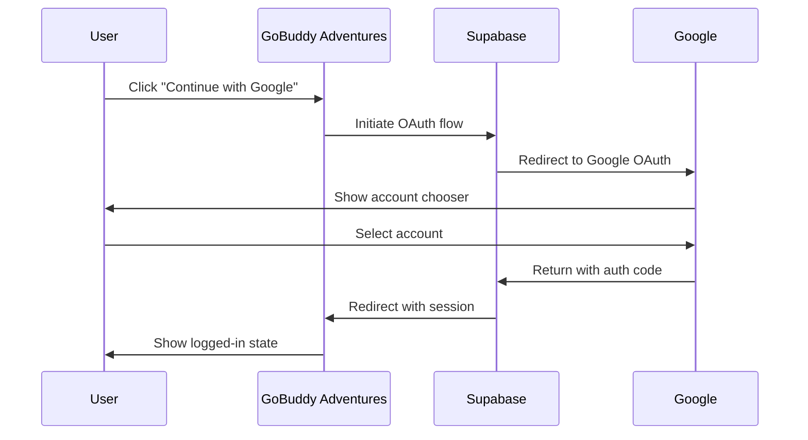

# Google OAuth Setup Guide for GoBuddy Adventures

This guide documents how to configure Google OAuth authentication for the GoBuddy Adventures travel planning application.

## Prerequisites

- A Google Cloud account
- Access to the Supabase dashboard for project `rtdjmykkgmirxdyfckqi`

## Configuration Summary

| Component | Value |
|-----------|-------|
| **Supabase Project** | `rtdjmykkgmirxdyfckqi` |
| **Google Cloud Project** | `gobuddy-adventures` |
| **OAuth Client Name** | `GoBuddy Adventures Web` |
| **Client ID** | `927661594030-rjadafq1lph1ooi1c5n72djac992n6lm.apps.googleusercontent.com` |

## Step 1: Google Cloud Console Setup

### 1.1 Create or Select a Project

1. Go to [Google Cloud Console](https://console.cloud.google.com/)
2. Create a new project or select an existing one
3. Name it: `gobuddy-adventures`

### 1.2 Configure OAuth Consent Screen

1. Navigate to **APIs & Services** → **OAuth consent screen**
2. Select **External** user type
3. Fill in the required fields:
   - **App name**: `GoBuddy Adventures`
   - **User support email**: Your email
   - **Developer contact email**: Your email
4. Click **Save and Continue** through remaining steps

### 1.3 Create OAuth Credentials

1. Go to **APIs & Services** → **Credentials**
2. Click **+ CREATE CREDENTIALS** → **OAuth client ID**
3. Select **Web application**
4. Name: `GoBuddy Adventures Web`

### 1.4 Configure Authorized Origins and Redirect URIs

**Authorized JavaScript origins:**
```
http://localhost:3000
```

**Authorized redirect URIs:**
```
https://rtdjmykkgmirxdyfckqi.supabase.co/auth/v1/callback
```

5. Click **Create**
6. Copy the **Client ID** and **Client Secret**

## Step 2: Supabase Configuration

### 2.1 Enable Google Provider

1. Open [Supabase Dashboard - Auth Providers](https://supabase.com/dashboard/project/rtdjmykkgmirxdyfckqi/auth/providers)
2. Find **Google** in the providers list
3. Toggle it **ON**
4. Enter your credentials:
   - **Client ID**: Your Google OAuth Client ID
   - **Client Secret**: Your Google OAuth Client Secret
5. Click **Save**

### 2.2 Verify Callback URL

The callback URL should be:
```
https://rtdjmykkgmirxdyfckqi.supabase.co/auth/v1/callback
```

This URL is automatically generated by Supabase and must match what's configured in Google Cloud Console.

## Step 3: Application Integration

The application uses Supabase's built-in OAuth flow. The auth page (`/auth`) includes a "Continue with Google" button that triggers the OAuth flow.

### Auth Flow Sequence



## Step 4: Production Deployment

When deploying to production, add these additional URLs:

### Google Cloud Console

**Authorized JavaScript origins:**
```
http://localhost:3000
https://your-production-domain.com
```

**Authorized redirect URIs:**
```
https://rtdjmykkgmirxdyfckqi.supabase.co/auth/v1/callback
```

### Supabase URL Configuration

1. Go to **Authentication** → **URL Configuration**
2. Update **Site URL** to your production domain
3. Add production domains to **Redirect URLs**

## Troubleshooting

### Error: "redirect_uri_mismatch"

This means the redirect URI in Google Cloud Console doesn't match the one Supabase is using.

**Solution:**
1. Check the exact callback URL in Supabase (under Google provider settings)
2. Ensure it's added to **Authorized redirect URIs** in Google Cloud Console
3. Wait 5 minutes for changes to propagate

### Error: "Access blocked: This app's request is invalid"

This happens when the OAuth consent screen is not properly configured.

**Solution:**
1. Go to **OAuth consent screen** in Google Cloud Console
2. Ensure all required fields are filled
3. For testing, add your email to **Test users** if using "External" user type

### Error: "Google provider not enabled"

**Solution:**
1. Verify Google is enabled in Supabase Auth Providers
2. Check that Client ID and Secret are correctly entered
3. Ensure there are no extra spaces in the credentials

## Security Notes

1. **Never commit Client Secret** to version control
2. Client secrets should only be stored in:
   - Supabase dashboard (for authentication)
   - Environment variables (if needed server-side)
3. The Client ID is safe to expose (it's visible in the browser)
4. For production, consider enabling additional security features in Google Cloud Console

## Testing the Integration

1. Navigate to `http://localhost:3000`
2. Click **Sign In** in the navigation
3. Click **Continue with Google**
4. Select your Google account
5. You should be redirected back to the app as a logged-in user
6. Check that:
   - Your name/email appears in the navigation
   - You can access protected routes like `/trips`
   - You can save itineraries to your account

## Configuration Completed

✅ Google Cloud Console: OAuth client created and configured
✅ Supabase: Google provider enabled with credentials
✅ GoBuddy Adventures: Auth page with Google sign-in button
✅ OAuth flow: Tested and working

---

*Last updated: February 6, 2026*
