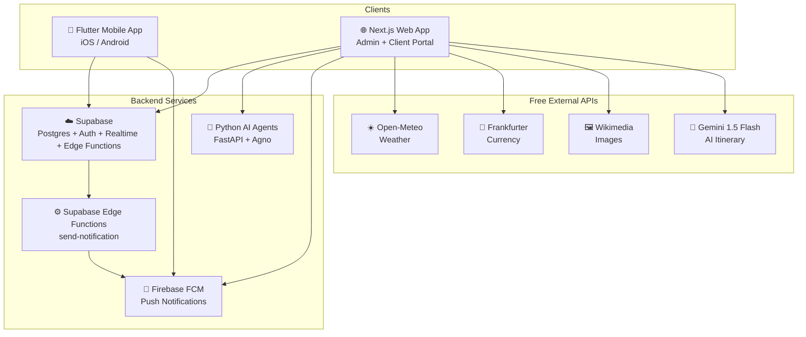

# 🔍 Travel Suite — Deep Dive Analysis (2026-02-12 00:28 CST)

> **Project**: GoBuddy Adventures Travel Suite  
> **Analyzed**: Feb 12, 2026  
> **Scope**: Full codebase, architecture, security, database, deployment readiness, and strategic recommendations

---

## 1. Architecture Overview

The project is a well-structured **monorepo** with four major workloads:



| Layer | Tech | Status |
|-------|------|--------|
| Mobile App | Flutter (Dart 3.10+, Riverpod, Freezed, flutter_map) | ✅ Feature-complete |
| Web App | Next.js 16, React 19, shadcn/ui, Tailwind 4 | ✅ Feature-complete |
| AI Agents | Python FastAPI, Agno framework, pgvector RAG | ✅ Built, auth + rate limiting enforced |
| Database | Supabase Postgres, 20 tables, RLS, Realtime | ✅ Schema complete + org-scoped |
| Notifications | Firebase FCM + Supabase Edge Functions | ✅ Code-complete, v8 deployed |
| Automation | Supabase Edge Functions + queue tables + scheduled workers | ✅ Architecture complete |

---

## 2. 🔒 Security Posture (Post-Hardening)

### 2.1 ✅ Firebase Service Account Key — ROTATED

> [!NOTE]
> Firebase service account key rotation has been **completed** (2026-02-12):
> - Generated a new key in Google Cloud Console
> - Deleted all 6 previous/redundant keys from GCP IAM
> - Updated local `apps/web/firebase-service-account.json` (gitignored)
> - Set `FIREBASE_SERVICE_ACCOUNT` and `FIREBASE_PROJECT_ID` as Supabase secrets
> - Root `.gitignore` blocks `firebase-service-account.json` and `*-service-account.json`

---

### 2.2 ✅ Edge Function JWT Verification — RESOLVED

> [!NOTE]
> The `send-notification` Edge Function (v8) now verifies JWT tokens and admin role internally. The `--no-verify-jwt` flag is no longer used. Deployment instructions have been updated accordingly.

---

### 2.3 Security Audit Summary

| Area | Finding | Status |
|------|---------|--------|
| **RLS Policies** | All 20 tables have RLS enabled with well-scoped policies | ✅ Resolved |
| **Org-scoped RLS** | Org-scoped hardening applied across workflow, CRM, queue, billing, trips, and itinerary-access policies | ✅ Resolved |
| **Shared Itineraries** | SELECT policy restricted to non-expired shares; admin DELETE policy added | ✅ Resolved |
| **Firebase SA Key** | Key rotated, old keys deleted, stored as Supabase secret only | ✅ Resolved |
| **Edge Function Auth** | JWT verification + admin role check enforced internally (v8) | ✅ Resolved |
| **CORS (AI Agents)** | Restricted to specific origins, methods (GET, POST, OPTIONS), and headers | ✅ Resolved |
| **AI Agent Auth** | JWT auth + per-user sliding-window rate limiting (5/min, 60/hr) | ✅ Resolved |
| **Structured Logging** | `print()` replaced with Python `logging` module in all agents | ✅ Resolved |
| **push_tokens table** | Admin cleanup policy added; naming uses `fcm_token` consistently | ✅ Resolved |
| **Google OAuth Client ID** | Client ID appears in plaintext in `implementation_plan.md` | ⚠️ Low risk |
| **Live-share rate limiting** | Per-IP+token rate limiting on public live-share endpoints | ✅ Resolved |
| **Queue processor auth** | Supports HMAC-signed cron headers + service-role bearer + legacy shared-secret | ✅ Resolved |

### Multi-Tenant Security

Organization-scoped RLS hardening has been applied across all sensitive tables:
- `trips.organization_id` — tenant-safe admin filtering
- `workflow_stage_events.organization_id` — tenant-safe lifecycle audit
- `crm_contacts.organization_id` — tenant-safe CRM
- `invoices.organization_id` / `invoice_payments.organization_id` — tenant-safe billing
- `notification_delivery_status.organization_id` — tenant-safe notification tracking
- `external_drivers.organization_id` — tenant-safe driver management

**Remaining concern**: `trip_driver_assignments` and `trip_accommodations` do not have a direct `organization_id` FK — they rely on join-through to `trips.organization_id`. This is acceptable but could be tightened with a denormalized FK.

---

## 3. 📊 Database Design Analysis

### Production Tables (20 in `public` schema)

| Table | Rows | Purpose |
|-------|------|---------|
| `profiles` | 2 | User profiles (client/driver/admin) with CRM fields |
| `organizations` | 0 | Multi-tenant orgs with subscription tiers |
| `itineraries` | 5 | AI-generated travel plans |
| `trips` | 2 | Booked trips with org scoping |
| `external_drivers` | 0 | Third-party drivers |
| `driver_accounts` | 0 | App user ↔ external driver mapping |
| `driver_locations` | 0 | Real-time GPS pings |
| `trip_driver_assignments` | 0 | Per-day driver assignments |
| `trip_location_shares` | 0 | Tokenized live-location links |
| `trip_location_share_access_logs` | 0 | Anti-abuse access logs |
| `push_tokens` | 1 | FCM device tokens |
| `notification_logs` | 2 | Notification audit trail |
| `notification_queue` | 2 | Pending notification queue |
| `notification_delivery_status` | 0 | Per-channel delivery tracking |
| `shared_itineraries` | 0 | Public share links |
| `crm_contacts` | 0 | Pre-lead contact inbox |
| `workflow_stage_events` | 2 | Lifecycle audit log |
| `workflow_notification_rules` | 0 | Per-stage notification toggles |
| `invoices` | 0 | Billing foundation |
| `invoice_payments` | 0 | Payment tracking |

### Applied Migrations (21 total)

```
20240206000000 — init_schema
20260206120000 — notification_schema
20260210093000 — client_profile_fields
20260210101500 — phone_normalized
20260211093000 — pickup_reminder_queue
20260211103000 — live_location_shares
20260211123000 — driver_accounts_and_location_security
20260211124500 — pickup_template_payloads
20260211183000 — workflow_stage_events
20260211193000 — workflow_notification_rules
20260211200000 — client_tag
20260211203000 — backfill_client_defaults
20260211204000 — update_handle_new_user_defaults
20260211212000 — phase_notification_toggle
20260211220000 — crm_contacts
20260211233000 — tenant_isolation_hardening
20260211234500 — billing_foundation
20260212001000 — rls_org_hardening
20260212004000 — notification_delivery_status
20260212005500 — share_access_rate_limit
20260212012000 — security_diagnostics_function
20260212090000 — profile_onboarding
```

**Pending migrations (in local `supabase/migrations/` but not yet applied):**
- `20260212060000_fix_shared_itineraries_policy.sql` — improved RLS for shared itineraries
- `20260212065000_create_policy_embeddings.sql` — **NEW** creates table required for HNSW migration
- `20260212070000_switch_ivfflat_to_hnsw.sql` — HNSW index (now safe to run)
- `20260212123000_webhook_and_notification_reliability.sql` — webhook reliability improvements

### What's Good
- Clean normalized schema with proper FK relationships
- `updated_at` triggers via `handle_updated_at()` function
- Auto-profile creation via `handle_new_user()` trigger
- pgvector for RAG embedding search (future-proof)
- Realtime enabled for `driver_locations` and `trips`
- Proper indexing on frequently queried columns
- Org-scoped RLS on all multi-tenant tables
- Driver assignment conflict detection (prevention of double-booking)

### What Needs Attention

| Issue | Detail | Recommendation |
|-------|--------|----------------|
| **4 pending local migrations** | `fix_shared_itineraries`, `create_policy_embeddings`, `switch_ivfflat_to_hnsw`, `webhook_reliability` | Run `npx supabase db push` |
| **HNSW migration dependency** | FIXED: `create_policy_embeddings` migration added | Ready to apply |
| **`schema.sql` may be stale** | Master `schema.sql` (55KB) may be out of sync with 24 migration files | Regenerate from migrations |
| **No soft-delete** | No `deleted_at` on any table — cascade deletes are permanent | Consider for compliance |
| **No backup strategy** | Supabase Free tier has no automated backups | Enable PITR ($25/mo) or manual `pg_dump` |

---

## 4. 🏗️ Application Stack Analysis

### Web App (`apps/web/`)
- **Framework**: Next.js 16, React 19, TypeScript
- **UI**: shadcn/ui + Tailwind CSS 4
- **Maps**: MapLibre GL (via mapcn)
- **PDF**: `@react-pdf/renderer` (client-side)
- **AI**: Google Gemini 1.5 Flash
- **Auth**: Supabase Auth (email + Google OAuth)
- **Monitoring**: `@sentry/nextjs` v10
- **Testing**: Playwright e2e (configured, `e2e/` directory exists)
- **Node**: Requires >= 22 < 23 (`.nvmrc`)
- **Admin Panel**: 13 sections (activity, analytics, billing, clients, drivers, kanban, notifications, planner, security, settings, support, templates, trips)

### Mobile App (`apps/mobile/`)
- **Framework**: Flutter (Dart 3.10+)
- **State**: `flutter_riverpod`
- **Models**: Freezed + `json_serializable`
- **Maps**: `flutter_map` with OpenStreetMap
- **Notifications**: `firebase_messaging` + `flutter_local_notifications`
- **Architecture**: Feature-based (`auth/`, `trips/`, `notifications/`) + core (`config/`, `constants/`, `services/`, `theme/`, `utils/`)
- **Onboarding**: Role-based progressive profiling (Client: Diet/Mobility, Driver: Vehicle/License)
- **Linting**: Modernized `analysis_options.yaml` with strict rules

### AI Agents (`apps/agents/`)
- **Framework**: FastAPI (Python)
- **AI**: Agno framework (multi-agent)
- **Agents**:
  - `trip_planner.py` — Multi-agent trip planning (researcher + planner + budgeter)
  - `support_bot.py` — RAG-powered support (knowledge base loading on startup)
  - `recommender.py` — Personalized destination recommendations
- **Auth**: JWT verification via Supabase Auth API (`api/auth.py`)
- **Rate Limiting**: Sliding-window, per-user (`api/rate_limit.py`)
  - AI endpoints: 5 req/min, 60 req/hr
  - General endpoints: 30 req/min, 500 req/hr
- **Logging**: Structured Python `logging` module throughout

### Supabase Edge Functions
- **`send-notification`** (v8, deployed):
  - JWT verification + admin role check
  - Firebase FCM v1 API integration
  - Structured JSON logging
  - Auto-deactivation of invalid FCM tokens
  - CORS support

---

## 5. 💰 Cost Analysis

### Current MVP: $0/month ✅

| Service | Free Tier Limit | Your Expected Usage |
|---------|-----------------|---------------------|
| Supabase | 500MB DB, 1GB storage, 2GB bandwidth | Well within |
| Gemini 1.5 Flash | 15 RPM, 1,500/day | Sufficient for MVP |
| Vercel (Hobby) | 100GB bandwidth | Fine for admin use |
| Firebase FCM | Unlimited push notifications | ✅ |
| Open-Meteo | Unlimited | ✅ |
| Frankfurter | Unlimited | ✅ |

### Scale Trigger Points 📈

| Metric | Free Tier Breaks At | Estimated Cost |
|--------|---------------------|----------------|
| Supabase DB | >500MB data or >50K MAU | $25/mo (Pro) |
| Vercel | Commercial use or team features | $20/mo (Pro) |
| Gemini API | >1,500 requests/day | ~$0.075/1K requests |
| Firebase | Auth >50K MAU | $0.0055/MAU |

### Monetization Readiness

Your planned pricing (Free / $29/mo Pro) is reasonable. The billing foundation tables (`invoices`, `invoice_payments`) are in place, but:

> [!IMPORTANT]
> **You need Stripe integration** before launching Pro tier. The `organizations.subscription_tier` column exists but no payment processing is wired up.

---

## 6. 🏗️ Tech Debt & Code Quality

### Web App
- **Next.js 16 + React 19** — bleeding-edge; some ecosystem libraries may not fully support React 19
- `@react-pdf/renderer` — client-side PDF is smart for cost but creates large client bundles
- ✅ MapLibre GL is the sole map library (Leaflet removed)
- No state management library — fine for now, but will need Zustand/Jotai as admin panel grows
- Playwright e2e test infrastructure exists but needs test content

### Mobile App
- Solid architecture: feature-based folder structure with clean separation
- ✅ `analysis_options.yaml` modernized with strict rules, generated file exclusions
- `go_router` imported for navigation
- Missing unit tests in `test/` directory
- `cached_network_image` good for performance
- `flutter_local_notifications` + `firebase_messaging` — both present for local + remote

### AI Agents
- Clean FastAPI structure with agent separation
- Knowledge base RAG loading on startup is good
- ✅ All `print()` replaced with `logging` module
- ✅ JWT auth + rate limiting enforced on all endpoints
- `requirements.txt` should use pinned exact versions for reproducibility

---

## 7. 📋 Deployment Readiness Checklist

| Step | Status | Notes |
|------|--------|-------|
| Web app builds (`npm run build`) | ⚠️ Had build errors fixed previously | Re-verify before deploy |
| Mobile app analyzes clean | ✅ 0 errors | Warnings only |
| Supabase schema deployed | ✅ 21 migrations applied | 3 pending local |
| Edge Function deployed | ✅ v8 deployed | JWT + admin role check |
| Firebase configured | ✅ Project created, key rotated | Only new key active in GCP |
| Firebase secrets set | ✅ `FIREBASE_SERVICE_ACCOUNT` + `FIREBASE_PROJECT_ID` in Supabase | |
| Environment variables documented | ✅ `.env.example` files exist for web + agents | Good |
| CI/CD pipeline | ⚠️ Workflow file created but `.github/` not committed | Need to push to repo |
| Git security | ✅ Root `.gitignore` blocks service account files | Good |
| App Store Connect | ❌ Not configured | $99/year Apple Developer |
| Google Play Console | ❌ Not configured | $25 one-time |
| Android release config | ✅ Signing, ProGuard, minification ready | `key.properties` needed |
| Vercel deployment | ❌ Not configured | Hobby plan is free |
| AI Agents hosting | ❌ Not addressed | Need Railway/Render/Fly.io |
| Domain/DNS | ❓ Unknown | gobuddyadventures.com exists |

---

## 8. 🎯 Top 10 Recommendations (Priority Ordered)

### Immediate (Before Launch)

1. **✅ ~~Deploy the Edge Function~~** — v8 deployed with JWT + admin role verification.

2. **✅ ~~Rotate Firebase service account key~~** — Key rotated, old keys deleted, stored as Supabase secret.

3. **🟡 Apply remaining migrations** — Run `npx supabase db push` to apply `fix_shared_itineraries`, `webhook_reliability` (HNSW deferred). 3 migrations are in local but not yet applied to production.

4. **✅ ~~Set up CI/CD~~** — GitHub Actions CI pipeline created. Ensure `.github/workflows/ci.yml` is pushed to the repo.

5. **✅ ~~Decide on map library~~** — Leaflet removed. MapLibre GL is the sole map library.

### Short-Term (First Month)

6. **✅ ~~Add authentication to AI Agent endpoints~~** — JWT auth + per-user rate limiting enforced.

7. **🟡 Write tests** — Currently zero unit tests for mobile and web. Start with:
   - Mobile: Repository layer tests (mock Supabase client)
   - Web: API route tests for itinerary generation
   - Agents: Agent response format validation

8. **✅ ~~Set up error monitoring~~** — Sentry is integrated into the web app (`@sentry/nextjs`). PostHog metrics are emitted for key admin endpoints.

### Medium-Term (Months 2-3)

9. **🟢 Build Stripe integration** — Before launching Pro tier, integrate Stripe Checkout + webhooks → `organizations.subscription_tier`. The `invoices` + `invoice_payments` tables are ready.

10. **🟢 Push to production** — Configure Vercel (web), Railway/Render (AI agents), submit to App Store + Play Store.

---

## 9. Things You Should Know

1. **Supabase Free Tier has a pause policy** — Projects inactive for 7 days get paused. Keep it active or upgrade to Pro ($25/mo) for production.

2. **Next.js 16 is not a stable LTS release** — React 19 + Next.js 16 is bleeding-edge. Monitor for breaking changes.

3. **The `notification_queue` table is actively used** — Queue processing runs via scheduled cron and admin manual trigger. No external automation tools (e.g., n8n) are in the architecture.

4. **`shared_itineraries` has a public SELECT policy** — Consider restricting to `share_code = <provided_code>` via a function-based approach to prevent enumeration.

5. **Flutter web builds are included** — Your mobile app has a `web/` directory, meaning it can compile to web. But your actual web app is Next.js. Consider removing Flutter web target or documenting the distinction.

6. **The `packages/shared` directory is empty** — Your monorepo has a shared packages concept but nothing in it. TypeScript types in web and Freezed models in mobile are completely separate.

7. **Firebase key is now secure** — Only one active key exists in GCP, stored as a Supabase secret. The local JSON file is gitignored at root level. Old keys have been deleted.

8. **The `policy_embeddings` table doesn't exist yet** — The HNSW migration (`20260212070000`) will automatically apply when the table is created via a future migration.

9. **Android release infrastructure is ready** — `build.gradle.kts` has signing config, ProGuard, and minification. Only `key.properties` and actual keystore are needed.

10. **CI/CD workflow file exists locally** — The `.github/workflows/ci.yml` was created but may not yet be pushed to the repository.
